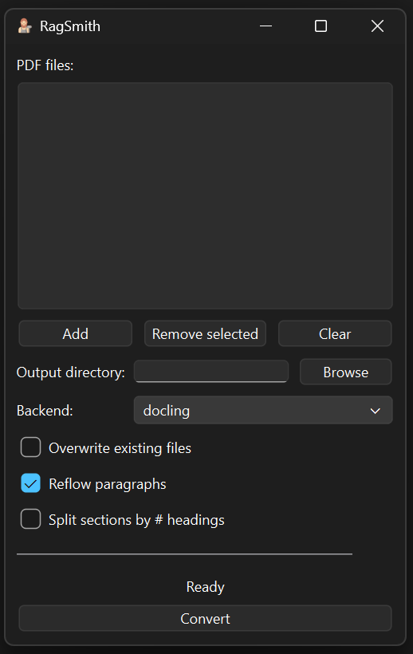

<h1 align="center">RagSmith</h1>


<p align="center">
  <a href="https://www.python.org/">
    
  </a>
  <a href="https://pypi.org/project/ragsmith/">
    
  </a>
  <a href="#">
    
  </a>
  <a href="#">
    
  </a>
  <a href="#">
    
  </a>
  <a href="#">
    
  </a>
  <a href="#">
    
  </a>
  <a href="#">
    
  </a>
  <a href="#">
    
  </a>
</p>

<h4 align="center">
RagSmith converts PDFs into clean, retrieval-ready Markdown. It provides a Python API, a CLI, and a PyQt6 desktop app, all built on a shared orchestration layer. It includes multiple conversion backends plus post-processing tools for cleaning, reflowing, and (optionally) splitting Markdown into structured sections.
</h4>

<p align="center">
  
</p>

---

## Project layout

```bash
RagSmith/
ragsmith/             # package (app, backends, processing, cli, ui)
requirements.txt
pyproject.toml
README.md
```

---

## Features

- Multiple PDF→Markdown backends: Docling (GPU-aware), PyMuPDF4LLM, and MarkItDown.
- Cleaning pipeline removing headers, footers, boilerplate, and repeated page markers.
- Optional paragraph reflow that preserves Markdown structure.
- Optional splitting into top-level sections for RAG chunking workflows.
- Unified orchestration layer powering the CLI and PyQt6 GUI.
- Minimal dependencies and modular backend selection.

---

## Installation

Create and activate a virtual environment, then install:

```bash
python -m venv .venv
source .venv/bin/activate
pip install -r requirements.txt
pip install -e .
```

For Docling GPU acceleration, install a CUDA-enabled torch build and choose the "cuda" device when configuring the Docling backend.

---

## CLI usage

Convert one or more PDFs:

```bash
python -m ragsmith.cli.main \
  --backend docling \
  --output-dir ./output \
  --split-sections \
  --reflow \
  file1.pdf file2.pdf
```

Common options:

- `--backend {markitdown,pymupdf4llm,docling}` select backend.
- `--output-dir PATH` directory for generated Markdown.
- `--split-sections` produce one Markdown file per top-level heading.
- `--reflow` enable structural paragraph reflow.
- `--overwrite` allow replacing existing files.

Entry point:

```bash
ragsmith-cli ...
```

---

## GUI usage

Launch the PyQt6 desktop app:

```bash
python -m ragsmith.ui.application
```

Or via entry point:

```bash
ragsmith-gui
```

The GUI supports backend selection, output directory selection, reflow toggling, splitting, and overwrite control.

---

## Library usage

Minimal example:

```python
from pathlib import Path
from ragsmith import PdfMarkdownApp, RagSmithConfig

config = RagSmithConfig(
    backend="docling",
    reflow=True,
    split_sections=True,
    overwrite=False,
)

app = PdfMarkdownApp(config)
app.convert_and_write([Path("paper.pdf")], output_dir=Path("./output"))
```

API surface:

- `convert_file(path)` return Markdown.
- `convert_files(paths)` return `{Path: Markdown}` mapping.
- `convert_and_write(paths, output_dir=None)` write `.md` files next to PDFs or into `output_dir`.

---

## Development notes

- Run `python -m compileall ragsmith` to validate syntax.
- Logging is configured via `ragsmith.logging_config.configure_logging`. Respect `RAGSMITH_LOG_LEVEL` if set.
- Custom exceptions:
  `BackendNotAvailableError`, `BackendConversionError`, `OutputWriteError`.
