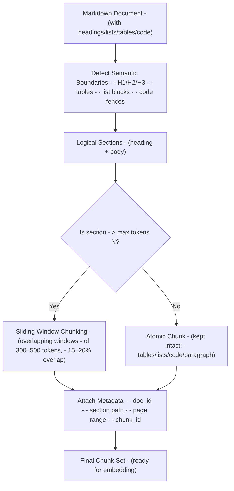
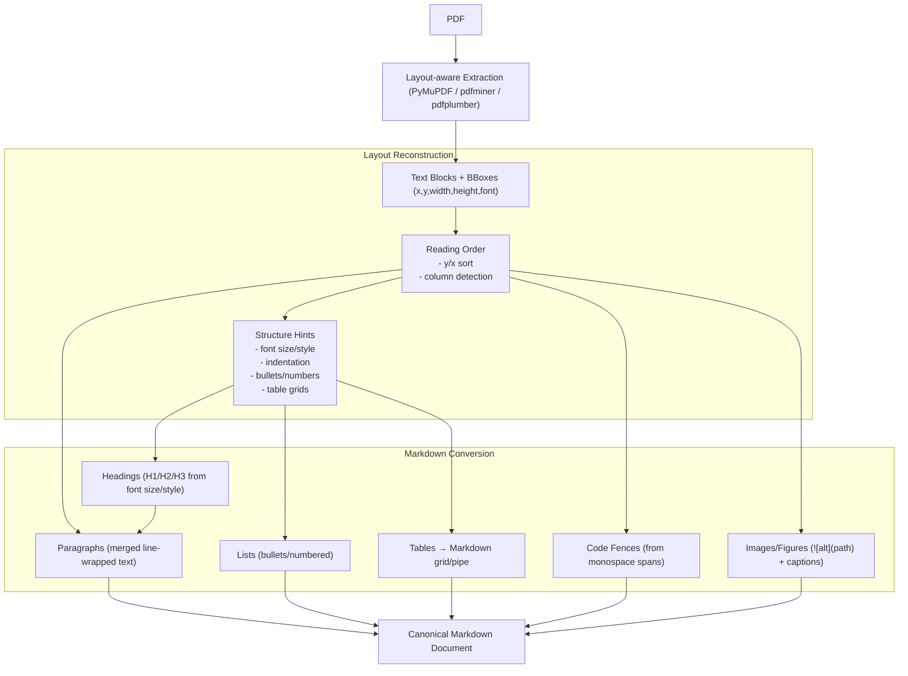
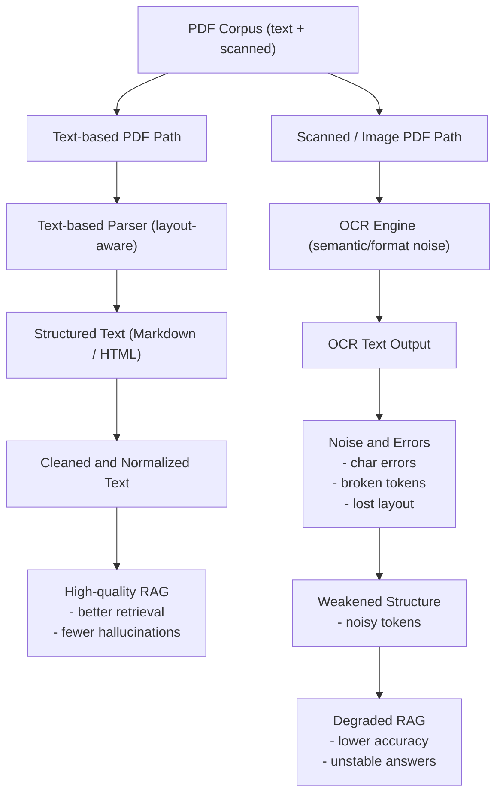
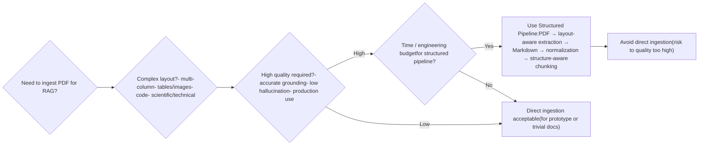
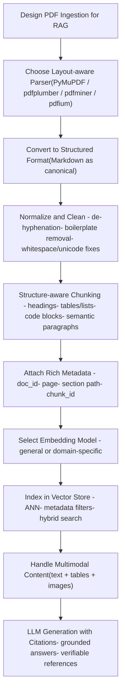

# Optimal PDF Ingestion Strategy for RAG Systems

## 1. Overview

Retrieval-Augmented Generation (RAG) systems derive their effectiveness largely from the quality of the underlying knowledge base. When ingesting documents in PDF format, the ingestion pipeline is critical because PDFs are not semantically structured text: they encode layout (glyphs, positions, vector graphics, images, tables), rather than logical structure. Poor ingestion leads to degraded:

* semantic coherence of text chunks
* embedding vector quality
* retrieval precision and recall
* grounding and citation accuracy
* hallucination control

Therefore, a controlled ingestion pipeline — converting PDFs into structured, normalized, chunkable text (e.g., Markdown) — tends to produce significantly better results than naive direct PDF-to-text ingestion.

```mermaid
flowchart TD
    %% Direct pipeline
    subgraph Direct["Direct PDF Ingestion"]
        DPDF["PDF"]
        DTXT["Generic PDF-to-text (flattened text)"]
        DNOISE["Artifacts & Noise - - Hyphenation - - Broken paragraphs - - Headers/footers - - OCR errors"]
        DLOSS["Structural Loss - - No headings - - No tables - - No lists - - No layout"]
        DCHUNK["Naive Chunking (sliding window only)"]
        DEMB["Embeddings (low semantic fidelity)"]
        DRET["Retrieval (low precision/recall)"]
        DANS["LLM Answers (high hallucination risk)"]

        DPDF --> DTXT --> DNOISE --> DLOSS --> DCHUNK --> DEMB --> DRET --> DANS
    end

    %% Structured pipeline
    subgraph Structured["Controlled Structured Ingestion"]
        SPDF["PDF"]
        SEXT["Layout-aware Extraction (PyMuPDF, pdfminer, pdfplumber)"]
        SMD["Structured Text (Markdown / HTML)"]
        SNORM["Normalization - (cleanup, de-hyphenation, boilerplate removal)"]
        SCHUNK["Structure-aware Chunking (headings, tables, lists)"]
        SEMB["Embeddings (high semantic fidelity)"]
        SRET["Retrieval (high precision/recall)"]
        SANS["LLM Answers (grounded, low hallucination)"]

        SPDF --> SEXT --> SMD --> SNORM --> SCHUNK --> SEMB --> SRET --> SANS
    end
```



---

## 2. Why Direct PDF Ingestion Often Fails in RAG Pipelines

### 2.1 Structural Loss

Generic PDF-to-text extractors often flatten layout, losing essential structure:

* Multi-column text becomes merged or interleaved incorrectly (reading order lost)
* Figures, tables, and captions can lose association or position
* Headings / sections (e.g. H1, H2) are lost — everything becomes body text
* Lists, bullet points, numbering, indentation are lost or mis-represented
* Code blocks, block quotes, tables — formatting lost

This structural loss makes it hard to chunk text semantically: chunks may mix unrelated content, split logical units incorrectly, or join unrelated sections — harming embedding semantic coherence.

### 2.2 Noise and Textual Artifacts

Common artifacts from naive extraction:

* Hyphenation from line wrapping (words split across lines)
* Sentence fragments across columns or page breaks
* Merged paragraphs or inappropriate breaks
* Repetition of headers/footers on each page (noise)
* Duplicated or mis-ordered content (especially in scanned or OCR’ed PDFs)
* OCR misrecognitions (if PDF is scanned) — introduces semantic noise

These artifacts distort the embedding space (embedding models treat noise as semantic signal), degrading retrieval accuracy and raising hallucination risk.

### 2.3 Loss of Semantic Cues That Embedding Models Expect

Embedding models (OpenAI, Cohere, Nomic, etc.) are typically trained on structured corpora: markdown / HTML / well-formatted text. These corpora contain semantic cues: headings, paragraph breaks, lists, tables. Without these cues, embedding models may encode documents suboptimally, resulting in weaker semantic similarity retrieval.

Empirical studies confirm: better upstream parsing and chunking improves downstream RAG quality. ([arXiv][1])

---

## 3. Advantages of a PDF → Markdown (or Other Structured Text) Conversion Layer

Converting PDFs into Markdown (or other structured formats) prior to chunking and embedding yields multiple practical and empirical benefits:

### 3.1 Semantic Preservation

Markdown allows preserving:

* Headings (converted from font size / style heuristics)
* Lists and numbered lists
* Tables (as Markdown tables)
* Inline formatting: bold, italic, code spans
* Code fences (for embedded code)
* Blockquotes or quoted paragraphs
* Inline links (if present)
* Images and figure references (optionally with captions / alt text)

This preserves the logical document structure and improves semantic coherence of chunks.

### 3.2 Clean, Controlled Normalization

With a conversion + normalization pipeline, engineers can reliably:

* Strip page headers/footers and page number boilerplate
* Fix hyphenation (re-join words split across lines)
* Merge fragmented paragraphs
* Normalize whitespace, Unicode quirks, invisible glyph noise
* Standardize encoding (UTF-8), unify line endings, remove artifacts
* Optionally convert mathematical formulas to LaTeX/MathML (if supported)

This produces stable, high-quality embeddings and reduces noise.

### 3.3 Structure-Aware, Deterministic Chunking

With structured text you can chunk based on semantic boundaries rather than arbitrary token windows:

* Split by headings (H1/H2/H3 …)
* Keep tables, lists, code blocks intact
* Maintain context: paragraphs, references, section metadata (heading, page, section id)
* Use sliding windows across semantic boundaries for overlap (e.g. 15–20%) ensuring context continuity

This improves retrieval relevance, especially for questions that rely on specific semantic units (e.g. paragraphs, code blocks, tables).

### 3.4 Rich Metadata and Grounding for Retrieval & Citation

Structured ingestion supports storing metadata per chunk: document id, page number, section heading, chunk id. Retrieval results can return not just bare text but rich context: where in the document it came from, which section, which page — enabling precise grounding and citation in LLM answers.

### 3.5 Compatibility with Industry Tooling & Maintainability

Markdown (or other structured text) is widely supported, human-readable, diffable (for QA), easy to version control, and well-suited for downstream pipelines (embedding, indexing, vector DB ingestion, retrieval, LLM prompting). This aligns with industry-standard RAG workflows rather than brittle, ad-hoc direct PDF ingestion.

---

## 4. Recommended Pipeline Architecture

### 4.1 High-Level Pipeline

```
PDF Document
   ↓ Layout-aware Extraction Engine (e.g. PyMuPDF, pdfminer.six, pdfplumber, pypdfium2)
   ↓ Structured Conversion → Markdown (or similar)
   ↓ Normalization (cleaning, de-hyphenation, boilerplate removal, whitespace/unicode normalization)
   ↓ Structure-aware Chunker (based on headings, lists, tables, logical blocks)
   ↓ Embedding Model (text embeddings)
   ↓ Vector Index (FAISS, Qdrant, Elasticsearch, Vespa, etc.)
   ↓ Retrieval Layer (vector + optional metadata / hybrid search)
   ↓ LLM Generator (context from retrieved chunks + citations/metadata)
```

### 4.2 Chunking Logic Model

```
Markdown Document (with headings, lists, tables, code blocks)
   └── Split by semantic boundaries (H1/H2/H3, tables, list blocks, code fences, figure captions)
          └── For large sections: sliding window token-based chunking (with overlap)
                 └── Final chunk set with metadata (doc_id, section, page, chunk_id, heading)
```

Chunk size target: typically 300–500 tokens (depending on embedding/context window), overlap 15–20% recommended for context continuity.

```mermaid
flowchart TD

  subgraph S4_7["Sections 4.1 & 7 - Canonical PDF Ingestion Pipeline for RAG"]
    direction LR

    PDF[("PDF Document")]
    EXTRACT["Layout-aware Extraction - (PyMuPDF, pdfminer, pdfplumber, - OCR fallback if needed)"]
    MARKDOWN["Structured Conversion - → Markdown"]
    NORMALIZE["Normalization - - de-hyphenation - - boilerplate removal - - Unicode/whitespace cleanup"]
    CHUNK["Structure-aware Chunking - - headings - - tables - - lists - - code blocks"]
    EMBED["Embedding Model - (domain-aware if needed)"]
    INDEX["Vector Index - (FAISS / Qdrant / Elasticsearch / Vespa)"]
    RETRIEVE["Retrieval Layer - - vector search - - metadata filters - - hybrid search"]
    LLM["LLM Generator - with grounded citations"]

    PDF --> EXTRACT --> MARKDOWN --> NORMALIZE --> CHUNK --> EMBED --> INDEX --> RETRIEVE --> LLM
  end
```





---

## 5. Engineering Implementation Details

### 5.1 Extraction Layer (Layout-Aware PDF Parsing)

Use libraries that provide layout-aware extraction, not naive linear text dumps. Examples:

* PyMuPDF (fitz) — fast, layout-aware, widely used for PDF → Markdown conversion. ([Artifex][2])
* pdfplumber / pdfminer.six — for more detailed extraction, table detection, etc. “Unstructured” document parsers also relevant. ([DZone][3])
* Optionally, fallback to OCR or Vision-based parsing when PDF is scanned/non-text — but with caution (see §6.2).

Implementation guidelines:

* Extract text blocks along with their bounding boxes (x/y coordinates), font sizes, styles
* Preserve reading order by sorting blocks by vertical position (y), then horizontal (x) or using more advanced heuristics if multi-column layout is present
* Detect columns, avoid interleaving across columns
* Detect and extract tables (via table heuristics or table-extraction libraries)
* Extract images/graphics optionally (for diagrams, charts) — possibly saving separately with references

### 5.2 Conversion Layer: Markdown as Canonical Intermediate Format

Why Markdown:

* Lightweight, human-readable, version-control friendly
* Supports headings, lists, tables, inline formatting, code fences — enough to preserve most of PDF semantics
* Easy diffing for QA / review; easy editing for corrections
* Downstream tools (chunkers, embedding pipelines) expect simple text + minimal markup

Recommended conversion procedural steps:

1. Map extracted text blocks into Markdown paragraphs
2. Identify font-size / style heuristics to reconstruct headings (H1, H2, etc.)
3. Reconstruct lists / bullets / numbered items based on indent, bullets, numbering patterns
4. Convert detected tables into Markdown tables (grid or pipe syntax), with header row and alignment where possible
5. Insert blank lines before and after tables, code blocks, images for readability
6. Embed images via `` or at least reference image alt-text or caption; optionally embed images as base64 if needed
7. Preserve links/annotations where available

This approach is implemented by tools such as the project RAG-Ingest which internally uses PyMuPDF and outputs Markdown including tables/images/code blocks. ([GitHub][4])

### 5.3 Normalization Layer

After Markdown conversion, apply deterministic cleanup:

* Remove boilerplate repeated headers/footers, page numbers
* De-hyphenate broken words (split across lines)
* Merge broken paragraphs / fix line breaks caused by layout
* Normalize Unicode (e.g. normalize combining marks, whitespace)
* Standardize whitespace (single spaces, remove trailing whitespace, unify line endings)
* Remove invisible glyph noise or non-printable artifacts
* Optionally canonicalize quotes, replace smart quotes with straight quotes, etc.

These steps help produce consistent, stable embeddings across ingestion runs, improving reproducibility and reducing noise.

### 5.4 Structure-Aware Chunking

Chunking should be aware of semantic boundaries; guidelines:

* Use headings (converted from font-size heuristics) as chunk boundaries. Each heading + its following content until the next heading becomes a chunk.
* Keep tables, lists, code blocks, figures/images intact in chunks — do not split them arbitrarily.
* For large sections, apply sliding-window chunking: split into overlapping chunks by token count (e.g. 300–500 tokens) with overlap (~15–20%) to preserve context.
* Assign and store rich metadata per chunk: document ID, section heading, page(s), chunk ID, possibly table-of-contents path. This metadata supports retrieval filtering, context attribution, and citation.

### 5.5 Embedding and Indexing

After chunking:

* Use a state-of-the-art text embedding model (e.g. embedding models from OpenAI, Cohere, Nomic, or open-source alternatives) compatible with token lengths and domain (technical vs. general).
* Optionally, for technical or domain-specific corpora, consider embedding models optimized for technical language (see recent research, §6.3).
* Store embeddings along with metadata in a vector index / vector store that supports approximate nearest neighbor (ANN) search, metadata filtering, and hybrid search (vector + sparse keyword/BM25). Common choices: FAISS, Qdrant, Elasticsearch, Vespa, etc.

### 5.6 Retrieval and Answer Grounding

At query time:

* Perform vector retrieval (optionally hybrid with sparse search) to fetch top-k relevant chunks based on query embedding + metadata filtering (e.g. by document, date, section, etc.)
* Return chunk text + metadata (document, section heading, page, chunk id) to the LLM generator
* The LLM uses retrieved chunks as context; citations (metadata) allow grounding answers — referencing which document / section / page chunk came from.
* When documents include images or tables, ensure that associated metadata and references are included so that images/tables can be retrieved and possibly rendered or summarized. This is especially important when the content is multimodal. Multi-modal RAG enables answering on images/tables as well as text. ([LangChain Blog][5])




---

## 6. Empirical Evidence & Research Findings

### 6.1 Quality of Parsing and Chunking Matters for RAG Performance

A recent empirical study Revolutionizing Retrieval-Augmented Generation with Enhanced PDF Structure Recognition (2024) shows that a RAG system with a “panoptic and pinpoint PDF parser” that preserves structural elements (headings, paragraphs, tables, images) significantly outperforms baseline naive parsers on real-world professional documents. ([arXiv][1])

Another evaluation OCR Hinders RAG: Evaluating the Cascading Impact of OCR on Retrieval-Augmented Generation (2024) demonstrates that using OCR on scanned PDFs can introduce “semantic noise” and “formatting noise,” which degrades RAG retrieval and answer quality. Even small OCR errors propagate through chunking, embedding, and retrieval — resulting in lower accuracy. ([arXiv][6])

These results confirm that ingestion quality (parsing + structuring) is a critical determinant of RAG system performance.

### 6.2 Challenges with OCR / Scanned PDFs and Multimodal Content

When PDF content is not text-based (scanned pages, images containing text, embedded figures/diagrams, tables), naive extraction fails.

* OCR may misrecognize characters, especially in technical documents (formulas, special symbols), causing semantic noise. ([arXiv][6])
* Even when text is extracted, structural information (which part belongs to the image, which to surrounding text) may be lost entirely, making grounding images / diagrams for answers impossible.
* For multimodal documents, it's beneficial to combine text parsing with image/diagram extraction and possibly use Vision-Language Models (VLMs) to interpret images or diagrams. A multi-vector retrieval approach (text + images + tables) improves the ability to answer diverse queries. ([LangChain Blog][5])

These challenges underscore the need for robust ingestion pipelines that handle mixed content, not just plain text.

### 6.3 Domain-Specific Embeddings for Technical Documents

General-purpose embedding models may underperform on technical or domain-specific corpora (e.g. scientific papers, engineering docs). Recent work Enhancing Technical Documents Retrieval for RAG (2025) shows that “Technical-Embeddings” — embedding models or pipelines tuned for technical language, context, and structure — significantly outperform traditional embeddings for retrieval tasks on technical documents (improved precision/recall, better handling of complex terminology). ([arXiv][7])

This suggests that — especially for engineering, scientific or domain-specific documents — one should consider embedding models tailored to domain semantics, and possibly chunking/metadata strategies that exploit domain structure (sections, equations, figure/table references).



---

## 7. Recommended Production Ingestion Pipeline (Canonical)

Based on best practices and empirical evidence, the following pipeline is recommended for production-grade RAG systems ingesting PDF documents:

1. PDF input — support both text-based and scanned PDFs
2. Layout-aware extraction — using a robust parser (PyMuPDF, pdfplumber, pdfminer.six, pdfium, or hybrid with image-based parsing when needed)
3. Conversion to structured format (Markdown) — preserving semantic structure (headings, lists, tables, code blocks, images)
4. Cleanup / normalization — de-hyphenation, whitespace/unicode normalization, boilerplate removal, paragraph merging
5. Structure-aware chunking — by semantic boundaries; maintain metadata (document, page, section, chunk-id)
6. Embedding — using general or domain-specific embedding models (consider domain-tuned embeddings for technical corpora)
7. Vector indexing — in vector store (FAISS, Qdrant, Elasticsearch, Vespa, etc.), with metadata support, optionally hybrid search (vector + sparse)
8. Retrieval layer — semantic search on embeddings, metadata filtering, hybrid methods when needed
9. (Optional) Multimodal handling — if documents include images/tables: store associated assets & metadata; use multi-vector retriever (text + images + tables) for multimodal queries.
10. LLM generation — feed retrieved chunks (with metadata) into LLM; generate answers with grounded citations (document, page, section, chunk ID).

This yields: high retrieval precision/recall; reduced hallucination; improved citation reliability; maintainable, auditable ingestion pipeline; compatibility with version control and QA.

---

## 8. When Direct PDF Ingestion Might Be Acceptable

Although structured conversion is strongly preferred, direct ingestion might be acceptable under limited conditions / tradeoffs:

* For quick prototyping, proof-of-concept, or low-stakes applications where perfect fidelity is not required
* For trivial documents: single-column, plain body text PDFs without complex layout, tables, images, code, or multi-column design
* When ingestion speed is critical and downstream noise is tolerable
* When you control downstream behavior (e.g. only keyword-based retrieval, not relying on precise citations or coherence)

In these cases direct ingestion might suffice; but for production systems aiming at high quality, reliability, and citation accuracy, structured ingestion remains best practice.



---

## 9. Expanded Source List & References

1. RAG-Ingest: PDF-to-Markdown Extraction and Indexing for RAG (GitHub) ([GitHub][4])
2. PyMuPDF4LLM / PDF-to-Markdown project for structured conversion from PDFs to Markdown optimized for RAG. ([GitHub][8])
3. “From PDFs to Markdown” — evaluation of open-source parsers for document ingestion (DEV Community) ([DEV Community][9])
4. “RAG / LLM and PDF: Conversion to Markdown Text with PyMuPDF” — demonstration of conversion benefits for RAG ingestion. ([Artifex][2])
5. Tutorial “How to parse PDF docs for RAG” by the OpenAI Cookbook — provides example workflows using pdfminer + image-based parsing. ([cookbook.openai.com][10])
6. Technical blog “RAG Speedrun: Local LLMs and Unstructured PDF Ingestion” — documents challenges and recommends structured parsing for real-world documents. ([Today I Learned][11])
7. Empirical research paper “Revolutionizing Retrieval-Augmented Generation with Enhanced PDF Structure Recognition” — demonstrates improved RAG performance with structure-aware parsing. ([arXiv][1])
8. Benchmark study “OCR Hinders RAG: Evaluating the Cascading Impact of OCR on Retrieval-Augmented Generation” — shows how OCR noise significantly degrades RAG quality. ([arXiv][6])
9. Paper “Beyond Extraction: Contextualising Tabular Data for Efficient Summarisation by Language Models” — highlights the importance of properly extracting and contextualizing tables for RAG summarization and QA. ([arXiv][12])
10. Blog “Building a Graph & LLM-Powered RAG Application from PDF Documents” (Neo4j) — demonstration of full pipeline from PDF ingestion to knowledge graph + retrieval + LLM QA. ([Graph Database & Analytics][13])

---

## 10. Recommendations and Best Practices (Checklist)

* Prefer layout-aware PDF parsers (PyMuPDF, pdfplumber, pdfminer, pdfium) over naïve PDF-to-text extractors
* Convert PDFs to structured intermediate format (Markdown) before chunking/embedding
* Clean and normalize extracted text: remove noise, de-hyphenate, remove boilerplate
* Chunk by semantic boundaries (headings, tables, lists, code) rather than blind token windows whenever possible
* Maintain rich metadata per chunk (document id, page, section heading, chunk id) for retrieval, filtering, citation
* Use domain-appropriate embedding models; consider domain-tuned embeddings for technical/scientific documents
* If document content includes images, tables, diagrams — design for multimodal retrieval (text + images + tables)
* Use vector stores supporting metadata filtering + hybrid search (vector + sparse) for flexibility
* Implement citation-aware retrieval + LLM generation to provide grounded, verifiable answers
  


---

## 11. Conclusion

Controlled ingestion — converting PDFs into structured, normalized Markdown (or similar) and applying structure-aware chunking prior to embedding — is strongly supported by both practical implementations and empirical research. This strategy consistently yields higher retrieval accuracy, better grounding, lower hallucination risk, and improved interpretability. Direct PDF ingestion should be limited to quick prototypes or trivial documents; for any production-grade RAG system dealing with non-trivial PDFs (technical reports, scientific papers, mixed-content documents), a structured ingestion pipeline is effectively mandatory for high-quality results.

[1]: https://arxiv.org/abs/2401.12599?utm_source=chatgpt.com "Revolutionizing Retrieval-Augmented Generation with Enhanced PDF Structure Recognition"
[2]: https://artifex.com/blog/rag-llm-and-pdf-conversion-to-markdown-text-with-pymupdf?utm_source=chatgpt.com "RAG/LLM and PDF: Conversion to Markdown Text with PyMuPDF"
[3]: https://dzone.com/articles/rag-model-for-pdf-content-extraction-and-query-answering?utm_source=chatgpt.com "Implementing a RAG Model for PDF Content Extraction and Query ... - DZone"
[4]: https://github.com/iamarunbrahma/rag-ingest?utm_source=chatgpt.com "RAG-Ingest: PDF to Markdown Extraction and Indexing for RAG"
[5]: https://blog.langchain.com/semi-structured-multi-modal-rag/?utm_source=chatgpt.com "Multi-Vector Retriever for RAG on tables, text, and images"
[6]: https://arxiv.org/abs/2412.02592?utm_source=chatgpt.com "OCR Hinders RAG: Evaluating the Cascading Impact of OCR on Retrieval-Augmented Generation"
[7]: https://arxiv.org/pdf/2509.04139?utm_source=chatgpt.com "Enhancing Technical Documents Retrieval for RAG - arXiv.org"
[8]: https://github.com/iamarunbrahma/pdf-to-markdown?utm_source=chatgpt.com "GitHub - iamarunbrahma/pdf-to-markdown: Conversion of PDF documents to ..."
[9]: https://dev.to/ashokan/from-pdfs-to-markdown-evaluating-document-parsers-for-air-gapped-rag-systems-58eh?utm_source=chatgpt.com "From PDFs to Markdown - DEV Community"
[10]: https://cookbook.openai.com/examples/parse_pdf_docs_for_rag?utm_source=chatgpt.com "How to parse PDF docs for RAG - OpenAI"
[11]: https://seantater.github.io/python/llm/rag/unstructured/pdf/2025/07/05/rag-speedrun-unstructured-pdfs.html?utm_source=chatgpt.com "RAG Speedrun: Local LLMs and Unstructured PDF Ingestion"
[12]: https://arxiv.org/abs/2401.02333?utm_source=chatgpt.com "Beyond Extraction: Contextualising Tabular Data for Efficient Summarisation by Language Models"
[13]: https://neo4j.com/blog/developer/graph-llm-rag-application-pdf-documents/?utm_source=chatgpt.com "Building an LLM-Powered RAG App from PDF Documents"
